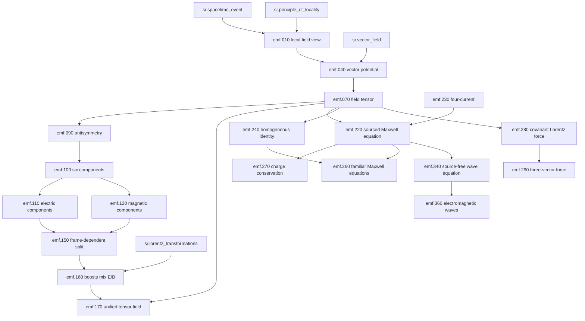

# Electromagnetic Field Fine-Grained Graph Experiment

Captured on 2026-07-26.

This repeats the fine-grained block/edge experiment for
`sr.electromagnetic_field`, using the MEE roles and edge types as a stress test.
It is not current runtime KB schema.

The source prose is [em_field_deep_exposition.md](em_field_deep_exposition.md).

## Working Assumptions

1. Fine-grained blocks remain attached to `sr.electromagnetic_field` for now.
2. Dependency order is the primary ordering target.
3. The numeric prefixes below are stable discussion handles, not authored
   presentation sequence.
4. This experiment should prefer reusing the MEE vocabulary unless a new role or
   edge type is clearly forced.

## Vocabulary Reuse

The MEE roles mostly work for the electromagnetic-field concept. The main
pressure point is that EM has governing equations, constraints, and interaction
laws, not just derivation formulas. For this pass, those are all represented as
`core_formula`. A later rename to `core_relation` or `central_relation` may be
clearer, but no new role is required yet.

The MEE edge types also mostly work. A tempting new edge would be `governs`,
from Maxwell's equations to the electromagnetic field. For now this experiment
uses `elaborates` and `requires` instead. If many future concepts need the
"equation governing object" relation, `governs` may deserve promotion.

## Role Vocabulary Used

| Role | Meaning in this experiment |
| --- | --- |
| `core_claim` | Main conceptual statement |
| `definition` | Meaning of a term, symbol, field, source, or frame split |
| `core_formula` | Central equation, identity, transformation, or law |
| `derivation_step` | Main mathematical or logical step |
| `algebra_support` | Optional hand-holding for a derivation step |
| `intuition` | Conceptual interpretation or scale-setting explanation |
| `warning` | Misconception, trap, or scope limit |
| `consequence` | Result that follows from a claim or formula |
| `example` | Concrete physical instance |
| `connection` | Link to another subject or later concept |
| `summary` | Compression of several preceding items |

## Edge Vocabulary Used

| Relation | Direction |
| --- | --- |
| `requires` | Source needs target as prior knowledge |
| `derives_from` | Source follows from target |
| `special_case_of` | Source is a restricted case of target |
| `elaborates` | Source expands target without being a prerequisite |
| `supplies_algebra_for` | Source gives hidden mathematical detail for target |
| `motivates` | Source creates the need for target |
| `warns_about` | Source marks an invalid or risky reading of target |
| `gives_example_of` | Source is an example of target |
| `connects_to` | Source links target to a different domain |

## Fine Blocks

### `emf.010.local_field_view`

Role: `core_claim`

A relativistic field is a physical quantity assigned locally to spacetime
events.

### `emf.020.field_values_over_spacetime`

Role: `definition`

Instead of one particle having a position \(q(t)\), a field has values
throughout spacetime, such as \(\phi(x)\), \(A^\mu(x)\), or
\(F_{\mu\nu}(x)\).

### `emf.030.locality_motivation`

Role: `intuition`

In relativity, influence is carried from event to nearby event rather than
transmitted instantly across space.

### `emf.040.vector_potential`

Role: `definition`

The electromagnetic field is most cleanly introduced through the four-potential
\(A_\mu(x)\).

### `emf.050.potential_components`

Role: `core_formula`

In a chosen convention,

\[
A^\mu=\left(\frac{\phi}{c},\mathbf A\right).
\]

### `emf.060.potential_unifies_scalar_and_vector`

Role: `core_claim`

The scalar potential \(\phi\) and vector potential \(\mathbf A\) are components
of one spacetime field.

### `emf.070.field_tensor_definition`

Role: `core_formula`

The electromagnetic field tensor is

\[
F_{\mu\nu}=\partial_\mu A_\nu-\partial_\nu A_\mu .
\]

### `emf.080.antisymmetric_derivative_intuition`

Role: `intuition`

The antisymmetric derivative extracts the curl-like part of the potential's
spacetime variation.

### `emf.090.field_tensor_antisymmetry`

Role: `derivation_step`

The definition implies

\[
F_{\mu\nu}=-F_{\nu\mu}.
\]

### `emf.100.six_independent_components`

Role: `consequence`

In four dimensions, an antisymmetric rank-two tensor has six independent
components.

### `emf.110.electric_from_time_space_components`

Role: `definition`

After an inertial frame is chosen, the time-space components of
\(F_{\mu\nu}\) are read as the electric field, up to convention-dependent signs
and factors of \(c\).

### `emf.120.magnetic_from_spatial_components`

Role: `definition`

The purely spatial antisymmetric components of \(F_{\mu\nu}\) are read as the
magnetic field.

### `emf.130.electric_from_potential`

Role: `core_formula`

In ordinary three-vector notation,

\[
\mathbf E=-\nabla\phi-\frac{\partial\mathbf A}{\partial t}.
\]

### `emf.140.magnetic_from_potential`

Role: `core_formula`

In ordinary three-vector notation,

\[
\mathbf B=\nabla\times\mathbf A .
\]

### `emf.150.frame_dependent_split`

Role: `core_claim`

The split into \(\mathbf E\) and \(\mathbf B\) is frame-dependent.

### `emf.160.boosts_mix_electric_and_magnetic`

Role: `consequence`

A Lorentz boost can mix what one observer calls electric with what another
observer calls magnetic.

### `emf.170.unified_tensor_field`

Role: `summary`

The electromagnetic field is one antisymmetric tensor field. Electric and
magnetic parts appear after an observer chooses a time-space split.

### `emf.180.gauge_transformation`

Role: `core_formula`

A gauge transformation changes the potential by

\[
A_\mu\rightarrow A_\mu+\partial_\mu\Lambda .
\]

### `emf.190.gauge_cancellation`

Role: `algebra_support`

The extra terms in \(F_{\mu\nu}\) cancel because

\[
\partial_\mu\partial_\nu\Lambda-\partial_\nu\partial_\mu\Lambda=0.
\]

### `emf.200.gauge_invariance`

Role: `consequence`

Gauge-related potentials represent the same physical electromagnetic field
because they give the same \(F_{\mu\nu}\).

### `emf.210.potential_not_unique_warning`

Role: `warning`

In classical electromagnetism, the physical field is captured by
\(F_{\mu\nu}\), not by a unique choice of \(A_\mu\).

### `emf.220.sourced_maxwell_equation`

Role: `core_formula`

The sourced Maxwell equations can be written schematically as

\[
\partial_\mu F^{\mu\nu}=\mu_0 j^\nu.
\]

### `emf.230.four_current_source`

Role: `definition`

The four-current packages charge density and current density into one
relativistic source:

\[
j^\mu=(c\rho,\mathbf j).
\]

### `emf.240.homogeneous_maxwell_identity`

Role: `core_formula`

The homogeneous Maxwell equations are encoded by

\[
\partial_\lambda F_{\mu\nu}
+\partial_\mu F_{\nu\lambda}
+\partial_\nu F_{\lambda\mu}=0.
\]

### `emf.250.f_equals_dA_implies_homogeneous_identity`

Role: `derivation_step`

The homogeneous identity follows from \(F=dA\), because the cyclic combination
contains second-derivative pairs that cancel.

### `emf.260.frame_split_maxwell_equations`

Role: `consequence`

When decomposed in a chosen inertial frame, the covariant equations become the
four familiar Maxwell equations for \(\mathbf E\) and \(\mathbf B\).

### `emf.270.charge_conservation_from_antisymmetry`

Role: `derivation_step`

Taking the divergence of the sourced Maxwell equation gives

\[
\partial_\nu\partial_\mu F^{\mu\nu}
=\mu_0\partial_\nu j^\nu .
\]

The left side vanishes by symmetry of the double derivative and antisymmetry of
\(F^{\mu\nu}\), so

\[
\partial_\mu j^\mu=0.
\]

### `emf.280.covariant_lorentz_force`

Role: `core_formula`

The electromagnetic field acts locally on a charged particle through

\[
\frac{dp^\mu}{d\tau}=qF^\mu{}_\nu U^\nu.
\]

### `emf.290.three_vector_lorentz_force`

Role: `consequence`

In a chosen inertial frame this contains

\[
\mathbf F=q(\mathbf E+\mathbf v\times\mathbf B).
\]

### `emf.300.operational_meaning_of_components`

Role: `intuition`

The frame-dependent electric and magnetic components describe how the unified
field pushes charged particles in that frame.

### `emf.310.field_energy_density`

Role: `core_formula`

In SI units, the electromagnetic energy density is

\[
u=\frac{1}{2}\left(\epsilon_0 E^2+\frac{1}{\mu_0}B^2\right).
\]

### `emf.320.poynting_vector`

Role: `core_formula`

The electromagnetic energy flux is

\[
\mathbf S=\frac{1}{\mu_0}\mathbf E\times\mathbf B.
\]

### `emf.330.stress_energy_connection`

Role: `connection`

Energy density, momentum density, energy flux, and stress are components of an
electromagnetic stress-energy tensor constructed from \(F_{\mu\nu}\) and the
metric.

### `emf.340.source_free_wave_equation`

Role: `core_formula`

In source-free regions and a suitable gauge, the potential satisfies a wave
equation such as

\[
\Box A^\mu=0.
\]

### `emf.350.dalembertian`

Role: `definition`

The d'Alembertian is

\[
\Box=\partial_\mu\partial^\mu
=\frac{1}{c^2}\frac{\partial^2}{\partial t^2}-\nabla^2 .
\]

### `emf.360.electromagnetic_waves`

Role: `consequence`

Electromagnetic waves are propagating disturbances of the same field tensor.

### `emf.370.plane_wave_geometry`

Role: `example`

In a plane wave, the electric component, magnetic component, and direction of
propagation are mutually perpendicular, and the Poynting vector points in the
propagation direction.

### `emf.380.misconception_summary`

Role: `summary`

The main traps are: treating \(\mathbf E\) and \(\mathbf B\) as independent
substances; treating the vector potential as unique; treating fields as mere
action-at-a-distance shortcuts; and treating Maxwell's equations as four
unrelated vector formulas.

## Edge List

| Source | Relation | Target | Note |
| --- | --- | --- | --- |
| `emf.010.local_field_view` | `requires` | `sr.spacetime_event` | Fields assign values at spacetime events. |
| `emf.010.local_field_view` | `requires` | `sr.principle_of_locality` | Locality motivates fields in relativity. |
| `emf.020.field_values_over_spacetime` | `elaborates` | `emf.010.local_field_view` | Gives examples of field-valued functions. |
| `emf.030.locality_motivation` | `motivates` | `emf.010.local_field_view` | Explains why a local field picture is natural. |
| `emf.040.vector_potential` | `requires` | `sr.vector_field` | The potential is a spacetime vector field. |
| `emf.040.vector_potential` | `requires` | `emf.010.local_field_view` | It is a field assigned across spacetime. |
| `emf.050.potential_components` | `elaborates` | `emf.040.vector_potential` | Gives a component convention. |
| `emf.060.potential_unifies_scalar_and_vector` | `derives_from` | `emf.050.potential_components` | Interprets the components as one object. |
| `emf.070.field_tensor_definition` | `derives_from` | `emf.040.vector_potential` | The tensor is built from the potential. |
| `emf.070.field_tensor_definition` | `requires` | `sr.field_tensor` | Uses the existing field-tensor concept. |
| `emf.080.antisymmetric_derivative_intuition` | `elaborates` | `emf.070.field_tensor_definition` | Explains why the derivative is antisymmetric. |
| `emf.090.field_tensor_antisymmetry` | `derives_from` | `emf.070.field_tensor_definition` | Swapping indices changes sign. |
| `emf.100.six_independent_components` | `derives_from` | `emf.090.field_tensor_antisymmetry` | Antisymmetry leaves six independent entries. |
| `emf.110.electric_from_time_space_components` | `derives_from` | `emf.100.six_independent_components` | Uses part of the six-component split. |
| `emf.110.electric_from_time_space_components` | `requires` | `sr.inertial_frames` | The split requires a frame. |
| `emf.120.magnetic_from_spatial_components` | `derives_from` | `emf.100.six_independent_components` | Uses the spatial part of the six-component split. |
| `emf.120.magnetic_from_spatial_components` | `requires` | `sr.inertial_frames` | The split requires a frame. |
| `emf.130.electric_from_potential` | `derives_from` | `emf.070.field_tensor_definition` | Time-space components give the ordinary electric-field formula. |
| `emf.130.electric_from_potential` | `elaborates` | `emf.110.electric_from_time_space_components` | Supplies the familiar three-vector expression. |
| `emf.140.magnetic_from_potential` | `derives_from` | `emf.070.field_tensor_definition` | Spatial components give the curl formula. |
| `emf.140.magnetic_from_potential` | `elaborates` | `emf.120.magnetic_from_spatial_components` | Supplies the familiar three-vector expression. |
| `emf.150.frame_dependent_split` | `derives_from` | `emf.110.electric_from_time_space_components` | Electric field is a frame reading. |
| `emf.150.frame_dependent_split` | `derives_from` | `emf.120.magnetic_from_spatial_components` | Magnetic field is a frame reading. |
| `emf.160.boosts_mix_electric_and_magnetic` | `derives_from` | `emf.150.frame_dependent_split` | Boosts change the time-space split. |
| `emf.160.boosts_mix_electric_and_magnetic` | `requires` | `sr.lorentz_transformations` | The mixing is produced by Lorentz transformations. |
| `emf.170.unified_tensor_field` | `derives_from` | `emf.150.frame_dependent_split` | The split points back to one object. |
| `emf.170.unified_tensor_field` | `derives_from` | `emf.160.boosts_mix_electric_and_magnetic` | Observer mixing supports the unified field view. |
| `emf.170.unified_tensor_field` | `connects_to` | `sr.electromagnetic_field` | Links the block back to the target concept being explained. |
| `emf.180.gauge_transformation` | `requires` | `emf.040.vector_potential` | Gauge transformations act on the potential. |
| `emf.190.gauge_cancellation` | `supplies_algebra_for` | `emf.200.gauge_invariance` | Shows the cancellation in \(F_{\mu\nu}\). |
| `emf.190.gauge_cancellation` | `derives_from` | `emf.180.gauge_transformation` | Expands the transformed tensor. |
| `emf.200.gauge_invariance` | `derives_from` | `emf.190.gauge_cancellation` | Cancellation leaves \(F_{\mu\nu}\) unchanged. |
| `emf.200.gauge_invariance` | `requires` | `sr.gauge_invariance` | Links to the existing gauge concept. |
| `emf.210.potential_not_unique_warning` | `warns_about` | `emf.040.vector_potential` | Avoids treating the potential as unique. |
| `emf.210.potential_not_unique_warning` | `derives_from` | `emf.200.gauge_invariance` | Gauge invariance explains non-uniqueness. |
| `emf.220.sourced_maxwell_equation` | `requires` | `emf.070.field_tensor_definition` | Maxwell's equations are written using \(F^{\mu\nu}\). |
| `emf.220.sourced_maxwell_equation` | `requires` | `emf.230.four_current_source` | The sourced equation needs the four-current. |
| `emf.220.sourced_maxwell_equation` | `elaborates` | `emf.170.unified_tensor_field` | Governing equation for the field, without introducing `governs` yet. |
| `emf.230.four_current_source` | `requires` | `sr.four_current` | Uses the existing source concept. |
| `emf.240.homogeneous_maxwell_identity` | `requires` | `emf.070.field_tensor_definition` | The identity is about the same field tensor. |
| `emf.250.f_equals_dA_implies_homogeneous_identity` | `derives_from` | `emf.070.field_tensor_definition` | The tensor is built as \(F=dA\). |
| `emf.250.f_equals_dA_implies_homogeneous_identity` | `derives_from` | `emf.190.gauge_cancellation` | Both use cancellation of commuting partial derivatives. |
| `emf.240.homogeneous_maxwell_identity` | `derives_from` | `emf.250.f_equals_dA_implies_homogeneous_identity` | The cyclic identity follows from \(F=dA\). |
| `emf.260.frame_split_maxwell_equations` | `derives_from` | `emf.220.sourced_maxwell_equation` | One half of the four familiar equations. |
| `emf.260.frame_split_maxwell_equations` | `derives_from` | `emf.240.homogeneous_maxwell_identity` | The other half of the four familiar equations. |
| `emf.260.frame_split_maxwell_equations` | `requires` | `emf.110.electric_from_time_space_components` | Frame split provides \(\mathbf E\). |
| `emf.260.frame_split_maxwell_equations` | `requires` | `emf.120.magnetic_from_spatial_components` | Frame split provides \(\mathbf B\). |
| `emf.270.charge_conservation_from_antisymmetry` | `derives_from` | `emf.220.sourced_maxwell_equation` | Take the divergence of the sourced equation. |
| `emf.270.charge_conservation_from_antisymmetry` | `requires` | `emf.090.field_tensor_antisymmetry` | Antisymmetry makes the divergence vanish. |
| `emf.270.charge_conservation_from_antisymmetry` | `connects_to` | `sr.charge_conservation` | Links to the charge-conservation concept. |
| `emf.280.covariant_lorentz_force` | `requires` | `emf.070.field_tensor_definition` | The force law uses \(F^\mu{}_\nu\). |
| `emf.280.covariant_lorentz_force` | `requires` | `sr.velocity_four_vector` | The force law uses four-velocity. |
| `emf.280.covariant_lorentz_force` | `requires` | `sr.momentum_four_vector` | The force law evolves four-momentum. |
| `emf.290.three_vector_lorentz_force` | `derives_from` | `emf.280.covariant_lorentz_force` | Frame split gives the familiar force law. |
| `emf.290.three_vector_lorentz_force` | `requires` | `emf.110.electric_from_time_space_components` | Electric force term. |
| `emf.290.three_vector_lorentz_force` | `requires` | `emf.120.magnetic_from_spatial_components` | Magnetic force term. |
| `emf.300.operational_meaning_of_components` | `elaborates` | `emf.290.three_vector_lorentz_force` | Explains why the components matter. |
| `emf.310.field_energy_density` | `requires` | `emf.110.electric_from_time_space_components` | Energy density uses electric strength. |
| `emf.310.field_energy_density` | `requires` | `emf.120.magnetic_from_spatial_components` | Energy density uses magnetic strength. |
| `emf.310.field_energy_density` | `connects_to` | `sr.em_energy_density` | Links to the existing field-energy concept. |
| `emf.320.poynting_vector` | `requires` | `emf.110.electric_from_time_space_components` | Poynting vector uses \(\mathbf E\). |
| `emf.320.poynting_vector` | `requires` | `emf.120.magnetic_from_spatial_components` | Poynting vector uses \(\mathbf B\). |
| `emf.320.poynting_vector` | `connects_to` | `sr.poynting_vector` | Links to the energy-flux concept. |
| `emf.330.stress_energy_connection` | `derives_from` | `emf.070.field_tensor_definition` | Stress-energy is constructed from the tensor. |
| `emf.330.stress_energy_connection` | `requires` | `sr.metric_tensor` | The metric is needed for contractions. |
| `emf.330.stress_energy_connection` | `connects_to` | `sr.em_stress_energy` | Links to the EM stress-energy concept. |
| `emf.340.source_free_wave_equation` | `special_case_of` | `emf.220.sourced_maxwell_equation` | Source-free region removes the current source. |
| `emf.340.source_free_wave_equation` | `requires` | `sr.lorenz_gauge` | A simple potential wave equation uses a suitable gauge. |
| `emf.340.source_free_wave_equation` | `requires` | `emf.350.dalembertian` | The wave equation uses \(\Box\). |
| `emf.350.dalembertian` | `requires` | `sr.metric_tensor` | The metric supplies the raised derivative. |
| `emf.360.electromagnetic_waves` | `derives_from` | `emf.340.source_free_wave_equation` | Waves are source-free propagating solutions. |
| `emf.360.electromagnetic_waves` | `connects_to` | `sr.electromagnetic_waves` | Links to the EM-wave concept. |
| `emf.370.plane_wave_geometry` | `gives_example_of` | `emf.360.electromagnetic_waves` | Plane wave geometry is the standard example. |
| `emf.370.plane_wave_geometry` | `requires` | `emf.320.poynting_vector` | Propagation direction is tied to \(\mathbf S\). |
| `emf.380.misconception_summary` | `warns_about` | `emf.170.unified_tensor_field` | Avoids treating E and B as independent substances. |
| `emf.380.misconception_summary` | `warns_about` | `emf.040.vector_potential` | Avoids treating the potential as unique. |
| `emf.380.misconception_summary` | `warns_about` | `emf.010.local_field_view` | Avoids action-at-a-distance interpretation. |
| `emf.380.misconception_summary` | `warns_about` | `emf.220.sourced_maxwell_equation` | Avoids treating Maxwell equations as unrelated formulas. |

## Main Dependency Spine

In this diagram, arrows point from prerequisite or support item to result. That
is the reverse of the edge-list direction for relations such as `requires` and
`derives_from`, where the source item names what it depends on.



## First Observations

The MEE vocabulary is less fragile than expected. It handled a second concept
with no strictly necessary new edge type.

The main role pressure is `core_formula`. In MEE it meant a central equation
such as \(E^2=p^2c^2+m^2c^4\). In the EM-field concept it also has to cover
definitions, identities, governing equations, gauge transformations, force laws,
and wave equations. That may be acceptable, but `core_relation` might be a
better long-term name.

The main edge pressure is the absent `governs` relation. Maxwell's equations
govern the electromagnetic field, but they do not simply derive from it or
elaborate it. I avoided adding `governs` here to keep the vocabulary stable.
If the same pressure appears in GR or QM, it should probably become a real edge
type.

Dependency order feels more natural here than it did for MEE. The EM-field
account can start from locality, vector fields, \(A_\mu\), and \(F_{\mu\nu}\),
then derive the observer's \(\mathbf E/\mathbf B\) split, Maxwell equations,
forces, energy, and waves.

## Comparison With MEE

| Question | MEE result | EM-field result |
| --- | --- | --- |
| Can roles transfer? | Mostly yes | Yes, with pressure on `core_formula` |
| Can edges transfer? | Mostly yes | Yes, with pressure for possible `governs` |
| Does dependency order work? | Works, but starts away from famous formula | Works naturally |
| Does detail emerge from edge type? | Yes: algebra/example/elaboration edges | Yes: algebra, frame split, and examples |
| Are content blocks attached to concepts enough? | Yes for first pass | Yes for first pass, but cross-concept links are frequent |

## Next Experiment

The next useful technical experiment would be to encode the MEE and EM-field
worksheets into a small temporary graph, then compute topological orders using
only:

```text
requires
derives_from
special_case_of
supplies_algebra_for
```

Edges such as `elaborates`, `warns_about`, `gives_example_of`, and
`connects_to` should probably not constrain the main dependency order. They are
better interpreted as optional expansions, annotations, or side paths.
