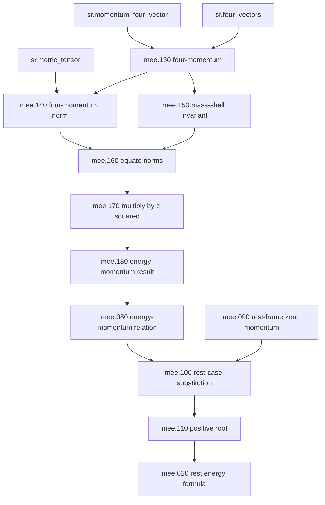

# MEE Fine-Grained Graph Experiment

Captured on 2026-07-26.

This is an experimental decomposition of
`sr.mass_energy_equivalence` into smaller teaching items and typed edges. It is
not current runtime KB schema. The goal is to discover a useful block size and
edge vocabulary before changing the main data files.

The source prose is [mee_deep_exposition.md](mee_deep_exposition.md).

## Working Assumptions

1. Fine-grained blocks remain attached to `sr.mass_energy_equivalence` for now.
2. The graph links those blocks to one another and to existing concepts.
3. Dependency order is the primary ordering target. The numeric prefixes below
   are only stable discussion handles and preserve the draft decomposition
   order.
4. Ordering should be tested by graph analysis later, especially through
   `requires`, `derives_from`, `special_case_of`, and selected support edges.

## Granularity Rule

A block should contain one teachable move:

- one conceptual claim,
- one definition,
- one line or move in a derivation,
- one optional algebraic support step,
- one example,
- one warning or misconception repair.

The block should be small enough to link, hide, expand, or reorder, but large
enough to remain meaningful when read alone.

## Roles Discovered

| Role | Meaning |
| --- | --- |
| `core_claim` | Main conceptual statement |
| `definition` | Meaning of a term, symbol, frame, or formula |
| `core_formula` | Central equation for the concept |
| `derivation_step` | Main mathematical or logical step |
| `algebra_support` | Optional hand-holding for a derivation step |
| `intuition` | Conceptual interpretation or scale-setting explanation |
| `warning` | Misconception, trap, or scope limit |
| `consequence` | Result that follows from a claim or formula |
| `example` | Concrete physical instance |
| `calculation_rule` | Operational formula used in problems |
| `connection` | Link to another subject or later concept |
| `summary` | Compression of several preceding items |

## Candidate Edge Types

| Relation | Direction |
| --- | --- |
| `requires` | Source needs target as prior knowledge |
| `derives_from` | Source follows from target |
| `special_case_of` | Source is a restricted case of target |
| `elaborates` | Source expands target without being a prerequisite |
| `supplies_algebra_for` | Source gives hidden mathematical detail for target |
| `motivates` | Source creates the need for target |
| `warns_about` | Source marks an invalid or risky reading of target |
| `gives_example_of` | Source is an example of target |
| `connects_to` | Source links target to a different domain |

For an initial implementation, the smallest useful subset is probably
`requires`, `derives_from`, `elaborates`, `supplies_algebra_for`,
`warns_about`, and `gives_example_of`. The others can remain experimental until
we see whether they earn their keep.

## Fine Blocks

### `mee.010.mass_as_invariant_energy`

Role: `core_claim`

Mass-energy equivalence says that mass is not merely a measure of "amount of
matter", but a measure of energy in its most invariant form.

### `mee.020.rest_energy_formula`

Role: `core_formula`

A body at rest, with no ordinary motion through space, still has rest energy:

\[
E_0 = mc^2 .
\]

### `mee.030.invariant_mass_and_conversion_factor`

Role: `definition`

Here \(m\) is the invariant mass of the object or system, and \(c^2\) is the
conversion factor between mass units and energy units.

### `mee.040.mass_energy_same_content`

Role: `intuition`

Mass and energy are not separate currencies. They are different ways of
measuring the same physical content.

### `mee.050.conversion_slogan_warning`

Role: `warning`

The slogan "mass can be converted into energy" is useful in nuclear physics but
can mislead. Mass is not a substance that turns into another substance called
energy.

### `mee.060.system_mass_statement`

Role: `core_claim`

The invariant mass of a system depends on the total energy and total momentum of
that system.

### `mee.070.energy_exchange_changes_mass`

Role: `consequence`

If an isolated system loses internal energy, perhaps by emitting radiation, its
mass decreases. If energy is added to a system, its mass increases.

### `mee.080.energy_momentum_relation`

Role: `core_formula`

The deeper relativistic statement is the energy-momentum relation:

\[
E^2 = \lVert \mathbf p \rVert^2 c^2 + m^2 c^4 .
\]

### `mee.090.rest_frame_zero_momentum`

Role: `definition`

In the rest frame of a massive object, the spatial momentum is zero:

\[
\mathbf p = 0 .
\]

### `mee.100.rest_case_substitution`

Role: `derivation_step`

Substituting \(\mathbf p=0\) into the energy-momentum relation gives

\[
E^2 = m^2 c^4 .
\]

### `mee.110.positive_energy_root`

Role: `algebra_support`

Taking the positive physical root gives

\[
E_0 = mc^2 .
\]

### `mee.120.rest_formula_scope`

Role: `warning`

\(E=mc^2\) is the energy of a massive object in its own rest frame. It is not
the full formula for the energy of a moving object.

### `mee.130.four_momentum_unifies_energy_momentum`

Role: `definition`

In special relativity, energy and momentum are components of a single
four-vector:

\[
p^\mu = \left(\frac{E}{c}, \mathbf p\right).
\]

### `mee.140.four_momentum_norm`

Role: `derivation_step`

With metric signature \(+---\), the invariant squared length of four-momentum is

\[
p^\mu p_\mu = \left(\frac{E}{c}\right)^2 - \lVert \mathbf p \rVert^2 .
\]

### `mee.150.mass_shell_invariant`

Role: `definition`

For a particle of invariant mass \(m\), the four-momentum norm is

\[
p^\mu p_\mu = m^2 c^2 .
\]

### `mee.160.equate_norms`

Role: `derivation_step`

Equating the two expressions for the invariant norm gives

\[
\left(\frac{E}{c}\right)^2 - \lVert \mathbf p \rVert^2 = m^2 c^2 .
\]

### `mee.170.multiply_by_c_squared`

Role: `algebra_support`

Multiplying by \(c^2\) gives

\[
E^2 - \lVert \mathbf p \rVert^2 c^2 = m^2 c^4 .
\]

### `mee.180.energy_momentum_result`

Role: `derivation_step`

Rearranging gives the energy-momentum relation:

\[
E^2 = \lVert \mathbf p \rVert^2 c^2 + m^2 c^4 .
\]

### `mee.190.four_momentum_geometry_summary`

Role: `summary`

Mass-energy equivalence is not an isolated miracle equation. It is a consequence
of the geometry of four-momentum.

### `mee.200.relativistic_mass_warning`

Role: `warning`

Older treatments sometimes write \(E=m_{\mathrm{rel}}c^2\), with
\(m_{\mathrm{rel}}\) increasing with speed. This can be made to work, but it
obscures the invariant structure.

### `mee.210.invariant_mass_convention`

Role: `definition`

The cleaner modern convention keeps \(m\) fixed as invariant mass and lets
energy \(E\) and momentum \(\mathbf p\) vary with frame.

### `mee.220.relativistic_energy`

Role: `core_formula`

For a massive particle in an inertial frame, the total energy can be written as:

\[
E = \gamma mc^2 .
\]

### `mee.230.lorentz_factor`

Role: `definition`

The Lorentz factor is

\[
\gamma = \frac{1}{\sqrt{1-v^2/c^2}} .
\]

### `mee.240.gamma_expansion`

Role: `algebra_support`

For small \(v/c\),

\[
\gamma \approx 1 + \frac{1}{2}\frac{v^2}{c^2}.
\]

### `mee.250.newtonian_limit`

Role: `consequence`

The relativistic energy becomes

\[
E \approx mc^2 + \frac{1}{2}mv^2 .
\]

The first term is rest energy; the second is Newtonian kinetic energy.

### `mee.260.composite_system_mass`

Role: `core_claim`

The invariant mass of a composite system is not generally the sum of the
invariant masses of its parts. Internal kinetic energy, field energy, stresses,
and binding energy all contribute.

### `mee.270.internal_energy_examples`

Role: `example`

A hot object has slightly more mass than the same object when cold. A compressed
spring has slightly more mass than the relaxed spring.

### `mee.280.nuclear_mass_defect`

Role: `example`

A bound nucleus has less mass than its separated protons and neutrons because
energy was released in forming the bound state.

### `mee.290.mass_defect_energy_release`

Role: `calculation_rule`

If final products have less invariant mass than the initial system, the
difference appears as kinetic energy, radiation, or other forms of energy:

\[
\Delta E = \Delta m c^2 .
\]

### `mee.300.c_squared_scale`

Role: `intuition`

The huge size of \(c^2\) means that a small mass difference corresponds to a
large energy release.

### `mee.310.massless_energy_relation`

Role: `derivation_step`

For \(m=0\), the energy-momentum relation becomes

\[
E^2 = \lVert \mathbf p \rVert^2 c^2,
\]

so

\[
E = \lVert \mathbf p \rVert c .
\]

### `mee.320.photon_no_rest_energy`

Role: `warning`

A photon has energy, but it has no rest frame and no rest energy. It does not
obey \(E_0=mc^2\).

### `mee.330.quantum_photon_energy`

Role: `connection`

In quantum theory, a photon's energy is also tied to frequency:

\[
E = h\nu .
\]

### `mee.340.massive_things_have_rest_energy`

Role: `summary`

\(E=mc^2\) should not be read as "only massive things have energy". Rather,
massive things have rest energy.

### `mee.350.compact_geometry_summary`

Role: `summary`

Energy and momentum form a four-vector; mass is the invariant length of that
four-vector; rest energy is what the energy component becomes when spatial
momentum vanishes.

### `mee.360.misconception_summary`

Role: `summary`

The main traps are: treating \(E=mc^2\) as the full energy formula; using
speed-dependent mass when invariant mass is clearer; imagining mass and energy
as substances; denying energy to massless particles; and adding component masses
without accounting for internal energy.

## Edge List

| Source | Relation | Target | Note |
| --- | --- | --- | --- |
| `mee.020.rest_energy_formula` | `elaborates` | `mee.010.mass_as_invariant_energy` | Gives the compact formula for the core claim. |
| `mee.030.invariant_mass_and_conversion_factor` | `elaborates` | `mee.020.rest_energy_formula` | Explains the symbols in the formula. |
| `mee.040.mass_energy_same_content` | `elaborates` | `mee.010.mass_as_invariant_energy` | Gives the preferred intuition. |
| `mee.050.conversion_slogan_warning` | `warns_about` | `mee.010.mass_as_invariant_energy` | Blocks the substance-conversion reading. |
| `mee.060.system_mass_statement` | `elaborates` | `mee.010.mass_as_invariant_energy` | Generalises from object mass to system invariant mass. |
| `mee.070.energy_exchange_changes_mass` | `derives_from` | `mee.060.system_mass_statement` | Energy loss or gain changes invariant mass. |
| `mee.090.rest_frame_zero_momentum` | `requires` | `sr.inertial_frames` | Rest frame is an inertial-frame idea. |
| `mee.100.rest_case_substitution` | `derives_from` | `mee.080.energy_momentum_relation` | Uses the full relation. |
| `mee.100.rest_case_substitution` | `requires` | `mee.090.rest_frame_zero_momentum` | Needs zero spatial momentum. |
| `mee.110.positive_energy_root` | `supplies_algebra_for` | `mee.100.rest_case_substitution` | Explains why the positive root is chosen. |
| `mee.020.rest_energy_formula` | `derives_from` | `mee.110.positive_energy_root` | Rest formula follows from the rest-frame case. |
| `mee.020.rest_energy_formula` | `special_case_of` | `mee.080.energy_momentum_relation` | The rest formula is the zero-momentum case. |
| `mee.120.rest_formula_scope` | `warns_about` | `mee.020.rest_energy_formula` | Prevents applying the formula to moving objects. |
| `mee.130.four_momentum_unifies_energy_momentum` | `requires` | `sr.momentum_four_vector` | Uses the existing momentum four-vector concept. |
| `mee.130.four_momentum_unifies_energy_momentum` | `requires` | `sr.four_vectors` | Requires the idea of a four-vector. |
| `mee.140.four_momentum_norm` | `requires` | `mee.130.four_momentum_unifies_energy_momentum` | Needs the four-momentum components. |
| `mee.140.four_momentum_norm` | `requires` | `sr.metric_tensor` | Metric supplies the invariant norm. |
| `mee.150.mass_shell_invariant` | `requires` | `mee.130.four_momentum_unifies_energy_momentum` | Defines invariant mass through four-momentum. |
| `mee.160.equate_norms` | `derives_from` | `mee.140.four_momentum_norm` | Uses the expanded norm. |
| `mee.160.equate_norms` | `derives_from` | `mee.150.mass_shell_invariant` | Uses the invariant mass value. |
| `mee.170.multiply_by_c_squared` | `supplies_algebra_for` | `mee.180.energy_momentum_result` | Optional algebraic hand-holding. |
| `mee.170.multiply_by_c_squared` | `derives_from` | `mee.160.equate_norms` | Algebraic manipulation of the invariant equation. |
| `mee.180.energy_momentum_result` | `derives_from` | `mee.170.multiply_by_c_squared` | Rearranged final relation. |
| `mee.080.energy_momentum_relation` | `derives_from` | `mee.180.energy_momentum_result` | The central formula is justified by the four-momentum derivation. |
| `mee.190.four_momentum_geometry_summary` | `derives_from` | `mee.180.energy_momentum_result` | Summarises the derivation. |
| `mee.200.relativistic_mass_warning` | `warns_about` | `mee.020.rest_energy_formula` | Avoids speed-dependent mass interpretation. |
| `mee.210.invariant_mass_convention` | `elaborates` | `mee.200.relativistic_mass_warning` | States the preferred modern convention. |
| `mee.220.relativistic_energy` | `requires` | `mee.230.lorentz_factor` | Relativistic energy uses gamma. |
| `mee.220.relativistic_energy` | `special_case_of` | `mee.080.energy_momentum_relation` | Massive-particle energy form is consistent with the full relation. |
| `mee.240.gamma_expansion` | `supplies_algebra_for` | `mee.250.newtonian_limit` | Optional approximation detail. |
| `mee.250.newtonian_limit` | `derives_from` | `mee.220.relativistic_energy` | Expands the relativistic energy. |
| `mee.250.newtonian_limit` | `derives_from` | `mee.240.gamma_expansion` | Uses the small-speed expansion. |
| `mee.260.composite_system_mass` | `elaborates` | `mee.060.system_mass_statement` | Applies system invariant mass to composite systems. |
| `mee.270.internal_energy_examples` | `gives_example_of` | `mee.260.composite_system_mass` | Hot objects and springs. |
| `mee.280.nuclear_mass_defect` | `gives_example_of` | `mee.260.composite_system_mass` | Bound nucleus example. |
| `mee.290.mass_defect_energy_release` | `derives_from` | `mee.070.energy_exchange_changes_mass` | Operational mass-energy bookkeeping. |
| `mee.290.mass_defect_energy_release` | `elaborates` | `mee.280.nuclear_mass_defect` | Explains nuclear energy release. |
| `mee.300.c_squared_scale` | `elaborates` | `mee.290.mass_defect_energy_release` | Explains why small mass changes matter. |
| `mee.310.massless_energy_relation` | `special_case_of` | `mee.080.energy_momentum_relation` | The massless case sets \(m=0\). |
| `mee.320.photon_no_rest_energy` | `warns_about` | `mee.020.rest_energy_formula` | Photons have no rest energy. |
| `mee.320.photon_no_rest_energy` | `derives_from` | `mee.310.massless_energy_relation` | Photon energy is momentum energy. |
| `mee.330.quantum_photon_energy` | `connects_to` | `mee.320.photon_no_rest_energy` | Links the SR point to quantum frequency. |
| `mee.340.massive_things_have_rest_energy` | `derives_from` | `mee.310.massless_energy_relation` | Massless case sharpens the correct reading. |
| `mee.350.compact_geometry_summary` | `derives_from` | `mee.130.four_momentum_unifies_energy_momentum` | Summary starts from four-momentum. |
| `mee.350.compact_geometry_summary` | `derives_from` | `mee.180.energy_momentum_result` | Summary includes invariant mass relation. |
| `mee.350.compact_geometry_summary` | `derives_from` | `mee.020.rest_energy_formula` | Summary includes the rest-frame formula. |
| `mee.360.misconception_summary` | `elaborates` | `mee.050.conversion_slogan_warning` | Collects the substance-conversion trap. |
| `mee.360.misconception_summary` | `elaborates` | `mee.120.rest_formula_scope` | Collects the rest-frame scope trap. |
| `mee.360.misconception_summary` | `elaborates` | `mee.200.relativistic_mass_warning` | Collects the relativistic-mass trap. |
| `mee.360.misconception_summary` | `elaborates` | `mee.320.photon_no_rest_energy` | Collects the massless-particle trap. |
| `mee.360.misconception_summary` | `elaborates` | `mee.260.composite_system_mass` | Collects the system-mass trap. |

## Main Derivation Spine

This is the most obvious chain to test with topological ordering.

In this diagram, arrows point from prerequisite or support item to result. That
is the reverse of the edge-list direction for relations such as `requires` and
`derives_from`, where the source item names what it depends on.

## First Observations

The human exposition starts with the memorable formula \(E_0=mc^2\), then
deepens it into the energy-momentum relation and four-momentum derivation.

The dependency graph wants the opposite direction: four-vectors and the metric
lead to four-momentum, then to the energy-momentum relation, then to rest
energy as a special case.

That is not a defect. For this experiment, dependency order should be treated as
the preferred presentation order. If that means the MEE text does not begin with
the famous formula \(E=mc^2\), that is acceptable.

The edge set also suggests that "detail" may emerge naturally from relation
types. Blocks linked by `supplies_algebra_for`, `elaborates`, or
`gives_example_of` are candidates for optional expansion without assigning a
manual detail score.

## Next Experiment

The next useful step would be to parse this worksheet mechanically, or convert
it into temporary CSV files under a sandbox data root, and compute:

1. which nodes are in the derivation spine,
2. which nodes are optional support,
3. which relation types create cycles,
4. what topological order emerges,
5. where graph order conflicts with the original prose order.

That would test the fine-grained graph idea without committing the main KB to a
new schema yet.
